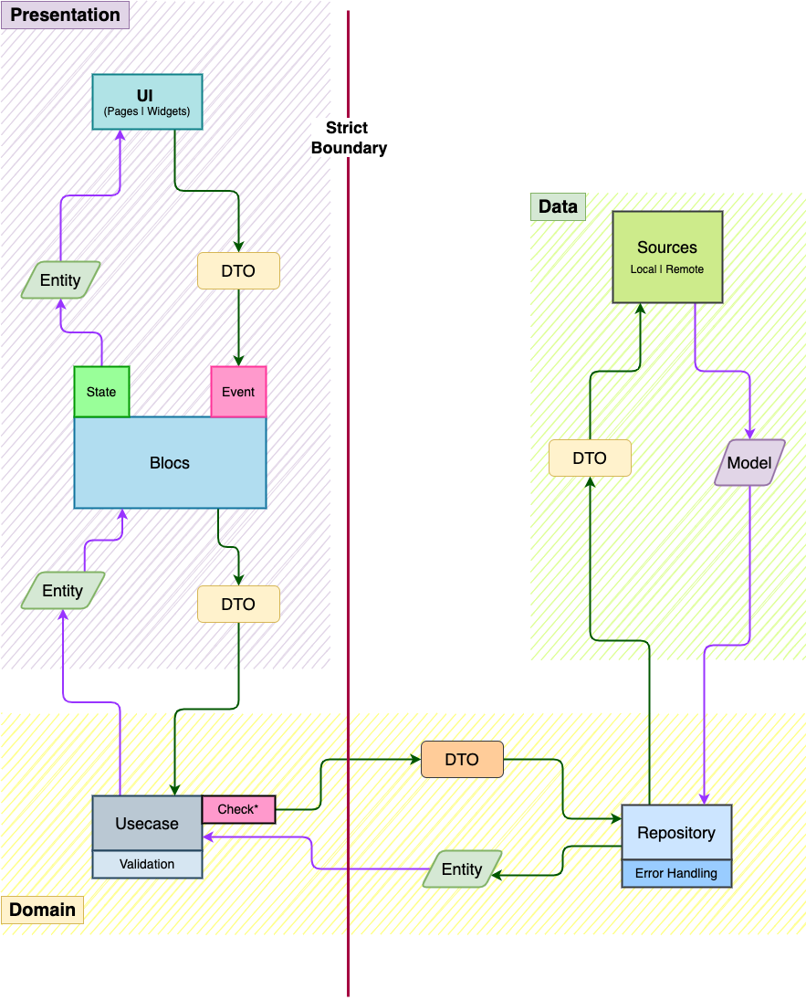

# Clean Architecture

An Example Todo Project using Clean Architecture and following strict
code structure and lint rules.

## Architectural Data Flow Diagram



<hr>

## Folder Structure

- lib
  - l10n
    - **app\_{lang_code}.arb**
  - src
    - app
      - flavors
      - injection
      - **app.dart**
    - core
      - base
      - configs
        - **app_config.dart**
      - constants
        - colors
        - constraints
          - **constraints.dart**
        - enums
        - themes
        - typography?
      - device
        - **connection_info.dart**
        - **network_info.dart**
      - error
        - **exception_to_failure_mapper.dart**
        - **exceptions.dart**
        - **failure_codes.dart**
        - **failures.dart**
      - utils
        - convertors
          - **route_information_to_uri.dart**
        - validators
          - **validators.dart**
    - external
      - _external_libraries_wrappers_
    - features
      - shared
        - feature_S
      - feature_A
        - data
          - models
          - sources
          - repositories
        - domain
          - dtos
          - entities
          - repositories
          - usecases
        - presentation
          - blocs
            - {_name1_}\_bloc
            - {_name2_}\_bloc...
          - pages
            - **{name}\_page.dart**
          - widgets
        - routes
          - **location.dart**
      - {_feature_name_}...
    - routes
  - **bootstrap.dart**
  - **main.dart**

<hr>

## Note

- \* Models are just an extension of Entities that adds Serialization/Deserialization functionality.
- \* **For a complex and large project we can use Entities instead of Models by adding Serialization/Deserialization functionality directly into the Entity Class.**

## Requirements

- ### Dependencies

```yaml
intl: ^0.17.0
flutter_localizations:
  sdk: flutter
  version: ^0.0.0
flutter_bloc: ^8.0.0
equatable: ^2.0.3
dartz: ^0.10.1
simple_connection_checker: ^0.2.1
connectivity_plus: ^2.2.1
get_it: ^7.2.0
gap: ^2.0.0
injectable: ^1.5.3
freezed_annotation: ^1.1.0
beamer: ^1.3.0
```

- ### Dev Dependencies

```yaml
flutter_lints: ^1.0.4
build_runner: ^2.1.7
injectable_generator:
freezed: ">=1.0.0 <1.1.1"
bloc_test: ^9.0.3
```

- ### analysis options

```yaml
# analysis_options.yaml
include: package:flutter_lints/flutter.yaml

linter:
  rules:
    # always_use_package_imports: true
    cancel_subscriptions: true
    throw_in_finally: true
    unnecessary_statements: true
    always_declare_return_types: true
    avoid_types_on_closure_parameters: true
    directives_ordering: true
    flutter_style_todos: true
    lines_longer_than_80_chars: true
    noop_primitive_operations: true
    public_member_api_docs: true
    sized_box_shrink_expand: true
    sort_child_properties_last: true
    sort_constructors_first: true
    type_annotate_public_apis: true
    unnecessary_lambdas: true
    unnecessary_late: true
    unnecessary_parenthesis: true
    use_decorated_box: true
    use_named_constants: true
    use_string_buffers: true
    use_to_and_as_if_applicable: true
    prefer_relative_imports: true
    await_only_futures: true
    prefer_void_to_null: true
    use_build_context_synchronously: true
    prefer_const_literals_to_create_immutables: true
    avoid_bool_literals_in_conditional_expressions: true
    avoid_catching_errors: true
    avoid_field_initializers_in_const_classes: true

analyzer:
  exclude:
    - "**/*.g.dart"
    - "**/*.freezed.dart"
  errors:
    invalid_annotation_target: ignore
```

## Explanation

WIP

## How To?

### Q1. How to generate locales?

- Add key, value and description(only in case of **_app_en.arb_**) to **lib/l10n/app\_{lang_code}.arb**
- run `flutter gen-l10n`

Note: _If `localization.local_key` showing error just restart dart analyzer._
